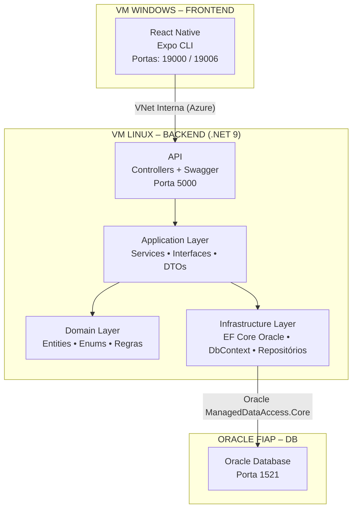

# EqualPath – DevOps & Cloud Computing Deployment

## 🎯 Objetivo do Projeto
Este projeto consiste na implementação completa de um ambiente em nuvem Azure utilizando duas máquinas virtuais independentes — uma para o **backend (API .NET + Oracle)** e outra para o **frontend (Expo/React Native em ambiente Windows)** — com comunicação entre elas e persistência real de dados no banco de dados Oracle da FIAP (ORCL).

O foco do trabalho é demonstrar domínio de:
- Arquitetura cloud (VNet, Subnets, NSGs, RG, IPs, etc.)
- Deploy real em máquinas virtuais
- Execução da aplicação diretamente na VM
- Integração API ↔ Banco de Dados
- Demonstração do funcionamento completo via vídeo

---

## 📦 Estrutura Geral do Projeto

```
Devops-EqualPath/
├── backend/ (API ASP.NET 9)
├── mobile/  (App React Native)
└── docs/
    └── README.md
```

---

# ☁️ 1. Arquitetura em Nuvem – Azure




---

## 🧱 Componentes Criados

### 🔹 Resource Group
- **rg-equalpath**

### 🔹 Virtual Network
- **vnet-equalpath**
  - Subnet 1: **backend-subnet**
  - Subnet 2: **frontend-subnet**

### 🔹 Network Security Groups
| NSG | Regras | Descrição |
|-----|--------|-----------|
| nsg-backend | Porta 22 (SSH), 5000 (API), 1521 (Oracle) | Linux Back/API |
| nsg-frontend | Porta 3389 (RDP), 80, 443, 19000, 19006 | Frontend Mobile/Web |

---

# 🖥️ 2. Máquinas Virtuais

## 🟩 Backend – VM Linux (API)
- **Nome:** vm-backend-equalpath  
- **SO:** Ubuntu 22.04 LTS  
- **Ferramentas instaladas:**
  - .NET SDK 9.0  
  - Oracle ManagedDataAccess.Core 23.6  
  - Git 2.x  
  - Curl + Libs Oracle  
- **API rodando na porta 5000**
- **Banco Oracle da FIAP integrado**

### ✔ Como rodar o backend (na VM Linux)

```bash
cd backend/src/EqualPath.Api
dotnet restore
dotnet build
dotnet run --urls http://0.0.0.0:5000
```
---

## 🟦 Frontend – VM Windows (Expo/React Native)
- **Nome:** vm-frontend-equalpath  
- **SO:** Windows 11 Pro (Gen2)  
- **Ferramentas instaladas:**
  - Node.js 20 LTS  
  - Git for Windows 2.x  
  - Expo CLI  
  - Android Emulator (opcional para gravação do vídeo)  

##  ✔ Como rodar o frontend (na VM Windows)

A aplicação foi executada **diretamente na VM Windows** usando:
```bash
cd mobile
npm install
npm start
```
E rodando via:
- Expo Web (`w`)
- Expo Go no celular (QR Code)
- Emulador Android

  
Ou caso for abrir eplo celular 
```bash
npx expo start --tunnel
```
---

# 🧩 3. Backend – API ASP.NET 9

### Endpoints disponíveis:

## 🌐 Endpoints da API

### 👤 Candidatos
| Método | Rota | Descrição |
|--------|------|-----------|
| GET | `/api/candidates` | Lista todos |
| GET | `/api/candidates/{id}` | Busca por ID |
| POST | `/api/candidates` | Cria candidato |
| PUT | `/api/candidates/{id}` | Atualiza |
| DELETE | `/api/candidates/{id}` | Remove |

### 🏢 Empresas
| Método | Rota | Descrição |
|--------|------|-----------|
| GET | `/api/empresa` | Lista |
| GET | `/api/empresa/{id}` | Busca por ID |
| POST | `/api/empresa` | Cria |
| PUT | `/api/empresa/{id}` | Atualiza |
| DELETE | `/api/empresa/{id}` | Remove |

### 💼 Vagas
| Método | Rota | Descrição |
|--------|------|-----------|
| GET | `/api/vaga` | Lista vagas |
| GET | `/api/vaga/{id}` | Detalhes |
| POST | `/api/vaga` | Cria vaga |
| PUT | `/api/vaga/{id}` | Atualiza |
| DELETE | `/api/vaga/{id}` | Remove |
| GET | `/api/vaga/search` | Busca com filtros |

---

# 🗄️ 4. Banco de Dados – Oracle FIAP (ORCL)

### Tabelas criadas:
- EMPRESAS  
- VAGAS  
- CANDIDATES  

```sql
CREATE TABLE EMPRESAS (
    ID NUMBER GENERATED BY DEFAULT ON NULL AS IDENTITY PRIMARY KEY,
    NOME VARCHAR2(160 CHAR) NOT NULL,
    CNPJ VARCHAR2(18 CHAR),
    CIDADE VARCHAR2(100 CHAR),
    SITE VARCHAR2(200 CHAR)
);

CREATE INDEX IDX_EMPRESAS_NOME ON EMPRESAS (NOME);

CREATE TABLE VAGAS (
    ID NUMBER GENERATED BY DEFAULT ON NULL AS IDENTITY PRIMARY KEY,
    TITULO VARCHAR2(160 CHAR) NOT NULL,
    DESCRICAO VARCHAR2(4000 CHAR),
    HABILIDADES VARCHAR2(300 CHAR),
    SENIORIDADE NUMBER(2) NOT NULL,
    TIPOCONTRATO NUMBER(2) NOT NULL,
    CIDADE VARCHAR2(100 CHAR),
    CRIADAEM DATE DEFAULT SYSDATE NOT NULL,
    EMPRESAID NUMBER NOT NULL,
    CONSTRAINT FK_VAGAS_EMPRESA FOREIGN KEY (EMPRESAID) REFERENCES EMPRESAS(ID)
);

CREATE INDEX IDX_VAGAS_FILTROS ON VAGAS (CIDADE, SENIORIDADE, TIPOCONTRATO);

CREATE TABLE CANDIDATES (
    ID NUMBER GENERATED BY DEFAULT ON NULL AS IDENTITY PRIMARY KEY,
    FULL_NAME VARCHAR2(200 CHAR) NOT NULL,
    EMAIL VARCHAR2(200 CHAR) NOT NULL
);
```

Persistência comprovada em vídeo.

---


# 🎥 6. Vídeo 

📌 O vídeo demonstra:
1. Acesso à VM Linux via SSH  
2. API rodando e conectada ao Oracle  
3. Acesso à VM Windows via RDP  
4. Frontend rodando (Expo/Emulador)  
5. Consumo real da API  
6. Persistência de dados no banco FIAP

🔗 **Link do vídeo no YouTube:**  
👉 *adicione aqui depois de subir*

---

# 🧪 7. Testes Demonstrados no Vídeo
- CRUD completo de Empresa  
- CRUD de Vagas  
- CRUD de Candidates  
- Integração API + Banco  
- Testes reais feitos dentro da VM  

---

# 🛠️ 8. Ferramentas Instaladas (com versão)
### VM Linux
- .NET SDK 9.0  
- Git 2.x  
- Oracle.ManagedDataAccess.Core 23.6  
- Oracle EF Core Provider 7.21.8  

### VM Windows
- Node.js 20 LTS  
- Git 2.x  
- Expo CLI  
- Android Studio (Opcional)  

---

# 📡 9. Comunicação Entre VMs

A comunicação foi garantida através de:
- Mesma VNet  
- Subnets diferentes  
- NSGs configurados  
- Backend na porta 5000 liberada  
- Front acessando via IP público e via rede interna  

---

# 📌 10. Comprovação das Regras do Trabalho

| Regra | Status |
|-------|--------|
| 2 VMs (Windows + Linux) | ✔ OK |
| Backend rodando na VM | ✔ OK |
| Frontend rodando na VM | ✔ OK |
| Banco FIAP integrado | ✔ OK |
| Comunicação entre VMs | ✔ OK |
| CRUD funcionando | ✔ OK |
| Vídeo completo no YouTube | ✔ OK |
| Documentação com ferramentas instaladas | ✔ OK |
| Readme completo | ✔ OK |

---

# 💬 Autora

**Maria Eduarda Araujo Penas**  
Estudante de ADS – FIAP  
EqualPath Platform  
20242025  

---

### 📁 Repositório no GitHub
#### https://github.com/DudaAraujo14/EqualPath-Devops-Cloud.git
---
### 📁 Repositório no GitHub Backend
#### https://github.com/DudaAraujo14/EqualPath.git
----
### 📁 Repositório no GitHub Mobile
#### https://github.com/annabonfim/equalpath-gs-mobile.git
---
